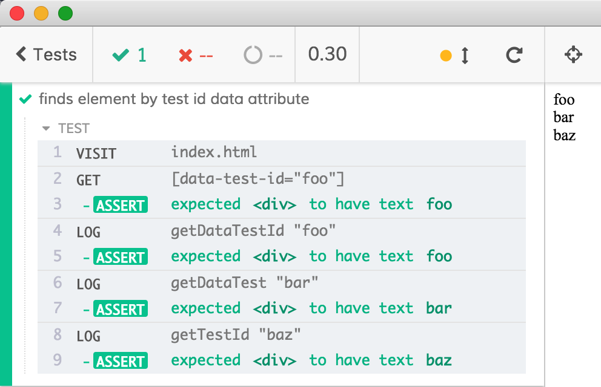

# cypress-get-it [](https://circleci.com/gh/bahmutov/cypress-get-it) [![renovate-app badge][renovate-badge]][renovate-app]

> Get elements by data attribute by creating a Cy command on the fly

[![NPM][npm-icon] ][npm-url]

## Why

According to the Cypress best practices for [Selecting Elements](https://on.cypress.io/best-practices#Selecting-Elements) using dedicated test id data attributes is the most stable way of finding elements during end-to-end tests. Yet typing the full selector is ... annoying.

```html
<div data-test-id="foo">foo</div>
```
```js
cy.get('[data-test-id="foo"]').should('have.text', 'foo')
```

Who has time for this!

So you could make a little utility function

```js
const tid = s => `[data-test-id="${s}"]`
cy.get(tid('foo')).should('have.text', 'foo')
```

Hmm, sure, but what if your HTML markup has different data attributes? Like this

```html
<div data-test-id="foo">foo</div>
<div data-test="bar">bar</div>
<div test-id="baz">baz</div>
```

Do you need to write 3 different helper functions? No. With `cypress-get-it` you can create data attribute selector _methods_ with descriptive names. In fact, the actual selector will be created _from the method name_ on the fly. You want to get element with `data-test-id=foo`? Just use camel cased words and call `cy.getDataTestId('foo')`. The above elements become

```js
cy.getDataTestId('foo').should('have.text', 'foo')
cy.getDataTest('bar').should('have.text', 'bar')
cy.getTestId('baz').should('have.text', 'baz')
```



So any element attribute like `foo-bar-baz="something"` could be fetched with descriptive `cy.getFooBarBaz("something")`.

## How it works

Load this plugin from your support file and it will replace global `cy` instance with an ES6 Proxy which will intercept any methods calls to `get...` and will call [`cy.get`](https://on.cypress.io/get) with the right selector automatically.

## Install and use

```shell
npm i -D cypress-get-it
```

Require this module from your `cypress/support/index.js`

```js
require('cypress-get-it')
```

### Small print

Author: Gleb Bahmutov &lt;gleb.bahmutov@gmail.com&gt; &copy; 2019

* [@bahmutov](https://twitter.com/bahmutov)
* [glebbahmutov.com](https://glebbahmutov.com)
* [blog](https://glebbahmutov.com/blog)

License: MIT - do anything with the code, but don't blame me if it does not work.

Support: if you find any problems with this module, email / tweet /
[open issue](https://github.com/bahmutov/cypress-get-it/issues) on Github

## MIT License

Copyright (c) 2019 Gleb Bahmutov &lt;gleb.bahmutov@gmail.com&gt;

Permission is hereby granted, free of charge, to any person
obtaining a copy of this software and associated documentation
files (the "Software"), to deal in the Software without
restriction, including without limitation the rights to use,
copy, modify, merge, publish, distribute, sublicense, and/or sell
copies of the Software, and to permit persons to whom the
Software is furnished to do so, subject to the following
conditions:

The above copyright notice and this permission notice shall be
included in all copies or substantial portions of the Software.

THE SOFTWARE IS PROVIDED "AS IS", WITHOUT WARRANTY OF ANY KIND,
EXPRESS OR IMPLIED, INCLUDING BUT NOT LIMITED TO THE WARRANTIES
OF MERCHANTABILITY, FITNESS FOR A PARTICULAR PURPOSE AND
NONINFRINGEMENT. IN NO EVENT SHALL THE AUTHORS OR COPYRIGHT
HOLDERS BE LIABLE FOR ANY CLAIM, DAMAGES OR OTHER LIABILITY,
WHETHER IN AN ACTION OF CONTRACT, TORT OR OTHERWISE, ARISING
FROM, OUT OF OR IN CONNECTION WITH THE SOFTWARE OR THE USE OR
OTHER DEALINGS IN THE SOFTWARE.

[npm-icon]: https://nodei.co/npm/cypress-get-it.svg?downloads=true
[npm-url]: https://npmjs.org/package/cypress-get-it
[renovate-badge]: https://img.shields.io/badge/renovate-app-blue.svg
[renovate-app]: https://renovateapp.com/
